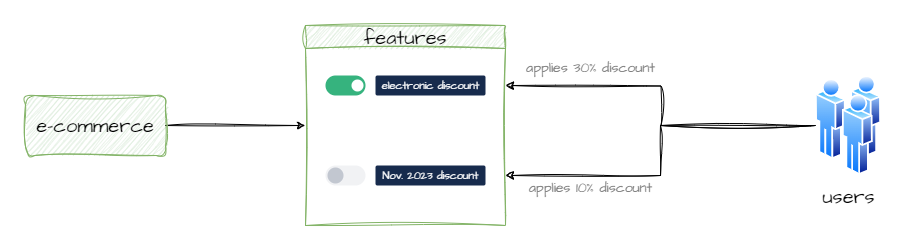

# feature-flags

## Introduction

Project with the purpose to apply and show the usage of "feature flags" concept, using the Togglz library in a Spring Boot application. 
Feature flags allow you to enable or disable specific features in your application without redeploying the code, making it easier to manage and release new features.



## Prerequisites

- Java 17 or higher
- Maven

## How can I test it?

```
mvn spring-boot:run
```

- **Get products without discounts:** http://localhost:8080/api/products
- **Get products with 'ELECTRONIC' discounts:** http://localhost:8080/api/products/ELECTRONIC

## Using togglz console

- **To `enable` or `disable` discount features** go to http://localhost:8080/togglz-console in your browser and use the UI.
  Try again the previous endpoints (Section: '_How can I test it_?') to see how the functionality works by applying/cancelling discounts without deploying new code.
- You can see the official documentation https://www.togglz.org. And support the project https://github.com/togglz/togglz.